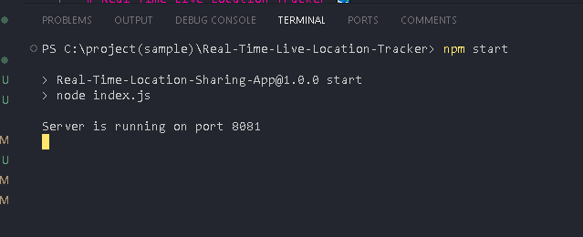

# Real-Time Live Location Tracker 🗺️

This Real-Time Location Sharing App is a web application that allows users to share their live location with others in real-time.

## Description ℹ️

The Real-Time Live Location Tracker is designed to facilitate seamless location sharing among users. Users can create a unique sharing ID, share it with friends or colleagues, and see their location updates on an interactive map.

### Features ✨

- **Real-time Location Sharing:** Users can share their live location with others in real-time.
- **Unique Sharing ID:** Each user is assigned a unique sharing ID for privacy and security.
- **Interactive Map:** Location updates are displayed on an interactive map for easy visualization.
- **User Authentication:** Secure user authentication to ensure only authorized users can access the application.
- **Responsive Design:** The application is designed to be responsive and accessible on various devices.

## Technologies Used

- **Node.js:** Backend server built with Node.js and Express.
- **Socket.IO:** Enables real-time communication between the server and clients.
- **Leaflet:** JavaScript library for interactive maps.
- **Bootstrap:** Frontend styling and layout.
- **jQuery:** Simplifies DOM manipulation and event handling.

## Screenshots 🎥

[.png)](./videos-images/Screenshot(linkgenerate).png)
[.png)](./videos-images/Screenshot(sharinglink).png)

## Functionalities 🛠️

- [ ] User authentication system
- [ ] Real-time location sharing functionality
- [ ] Interactive map display
- [ ] Unique sharing ID generation
- [ ] Responsive design for mobile devices

## Getting Started 🚀

To get started with the Real-Time Live Location Tracker, follow these steps:

1. Clone the repository: `git clone https://github.com/pendemvamsi/Real-Time-Live-Location-Tracker.git`
2. Install dependencies: `npm install`
3. Start the application: `npm start`

## Contributing 🤝

Contributions are welcome! Please feel free to submit a pull request or open an issue for any features or bug fixes.
